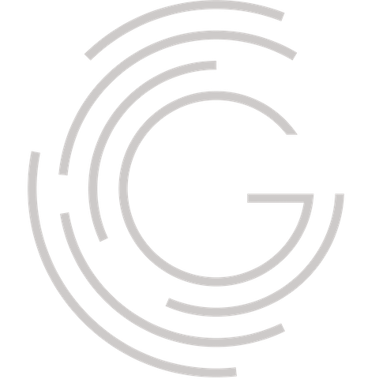

# n8n-nodes-greynoise

This is an n8n community node for interacting with the [GreyNoise](https://viz.greynoise.io/) cybersecurity platform.

[n8n](https://n8n.io/) is a [fair-code licensed](https://docs.n8n.io/reference/license/) workflow automation platform.

- [Installation](#installation)
  - [Community Nodes (Recommended)](#community-nodes-recommended)
  - [Manual installation](#manual-installation)
- [Operations](#operations)
  - [Community](#community)
  - [Enterprise](#enterprise)
- [Credentials](#credentials)
- [Compatibility](#compatibility)
- [Resources](#resources)
- [License](#license)

## Installation

Follow the [installation guide](https://docs.n8n.io/integrations/community-nodes/installation/) in the n8n community nodes documentation.

### Community Nodes (Recommended)

For users on n8n v0.187+, your instance owner can install this node from [Community Nodes](https://docs.n8n.io/integrations/community-nodes/installation/).

1. Go to **Settings > Community Nodes**.
2. Select **Install**.
3. Enter `n8n-nodes-ldap` in **Enter npm package name**.
4. Agree to the [risks](https://docs.n8n.io/integrations/community-nodes/risks/) of using community nodes: select **I understand the risks of installing unverified code from a public source**.
5. Select **Install**.

After installing the node, you can use it like any other node. n8n displays the node in search results in the **Nodes** panel.

### Manual installation

To get started install the package in your n8n root directory:

`npm install n8n-nodes-ldap`

For Docker-based deployments add the following line before the font installation command in your [n8n Dockerfile](https://github.com/n8n-io/n8n/blob/master/docker/images/n8n/Dockerfile):

`RUN cd /usr/local/lib/node_modules/n8n && npm install n8n-nodes-ldap`

## Operations

### Community

- **Community IP**: Query IPs in the GreyNoise dataset
  - `IP`: The IP to query

### Enterprise

- **GNQL Query**: GNQL (GreyNoise Query Language)
  - `Query`: The GNQL query to run
  - `Limit`: Maximum amount of results to grab (0..10,000)
- **GNQL Stats**: Get aggregate statistics for the top organizations, actors, tags, ASNs, countries, classifications, and operating systems of all the results of a given GNQL query.
  - `Query`: The GNQL stats query to run
  - `Limit`: Maximum amount of results to grab (0..10,000)
- **IP Context**: Get more information about a given IP address. Returns time ranges, IP metadata (network owner, ASN, reverse DNS pointer, country), associated actors, activity tags, and raw port scan and web request information.
  - `IP`: The IP to query
- **IP Quick Check**: Check whether a given IP address is “Internet background noise”, or has been observed scanning or attacking devices across the Internet.
  - `IP`: The IP to query
- **Multi-IP Context**: Get more information about given IP addresses. Returns time ranges, IP metadata (network owner, ASN, reverse DNS pointer, country), associated actors, activity tags, and raw port scan and web request information.
  - `IPs`: Comma separated list of IPs to query
- **Multi-IP Quick Check**: Check whether given IP addresses are “Internet background noise”, or have been observed scanning or attacking devices across the Internet.
  - `IPs`: Comma separated list of IPs to query
- **RIOT IP Lookup**: RIOT identifies IPs from known benign services and organizations that commonly cause false positives in network security and threat intelligence products. The collection of IPs in RIOT is continually curated and verified to provide accurate results.
  - `IP`: The IP to query
- **Tag Metadata**: Get a list of tags and their respective metadata

## Credentials

You can use the GreyNoise Community service without authentication, however you will be limited in the number of requests you can send. For more requests, or enterpise functionality, you can [sign-up](https://viz.greynoise.io/signup) for an account.

- **Token**: The GreyNoise API token

## Compatibility

n8n v0.187+

## Resources

- [n8n community nodes documentation](https://docs.n8n.io/integrations/community-nodes/)

## License

[MIT](https://github.com/pemontto/n8n-nodes-ldap/blob/master/LICENSE.md)
